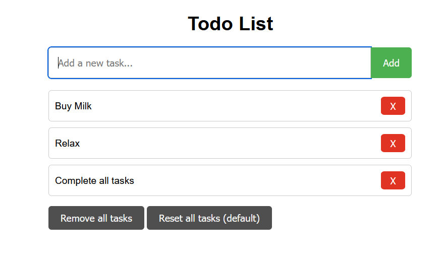

# Context
This is a simple html app with some basic "TODO list" functionality.

# Instructions
> 21.09.2023 If you were an attendee of the workshop and want to do it again in your spare time.
> 
> Find the file called `instructions.md` and follow the checklist

## Run the app
- Navigate to the `src/webapp` folder
- `npm install`
- `npm run start-server`

Then you'll be able to navigate to the `localhost:8080` in your browser and use the app.

## Running tests
### Unit tests (Jest)
- Navigate to the `src/webapp/api` folder
- `npm install`
- `npm run test`

### E2E tests (Cypress)
- Navigate to the `e2e/` folder
- `npm install`
- `npm run test`

Alternatively you could run `npm run open` to open Cypress UI and start the tests from there.
> Note that the tests would fail if you are NOT running the todo app, see the instructions above ⬆️ 